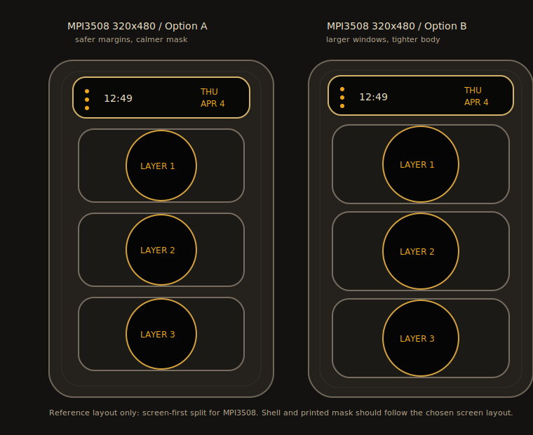

# Form Factor

This document defines the current physical and screen-layout direction.

## Hardware Baseline

Use a Raspberry Pi 5-sized object envelope as the hardware baseline, not
Raspberry Pi 5 identity as the product baseline.

Current prototype display path:

- Raspberry Pi 5 with MPI3508 3.5-inch HDMI display.
- The UI should also remain testable on a laptop browser.
- The enclosure should stay compatible with a Pi 5 + display stack for the
  hackathon, but the final object should be designed from product needs first:
  it listens, shows four signals, gets warm, needs power, and is held or worn.

Do not copy Raspberry Pi 5 port positions, board cutouts, or case conventions
onto the final shell unless the actual internal stack requires them. Pi 5 is a
size and thermal reference, not an external design template.

## Object Direction

The object should feel like a compact wearable signal instrument.

Reference direction:

- Thick vertical body.
- Soft rectangular outer shell.
- Top narrow information strip.
- Three large stacked signal windows.
- Side thumb control, shaped like a long rail or lever.
- Shoulder-strap mounting path.

The object can be slightly bulky. Do not hide the thickness too aggressively;
display, battery or power path, cable clearance, heat, and mounting hardware all
need room.

## First-Principles Enclosure Layout

The front face is the ritual surface: screen, signal, and `free will`. Keep it
quiet. Microphone holes, vents, screw heads, and power openings should live on
the edges or back unless a measured acoustic or thermal reason forces a front
opening.

Required exterior functions:

- Power/data: one USB-C opening, preferably on the bottom edge so the cable
  exits with gravity and does not compete with the side thumb control.
- Listening: one or two very small microphone holes, preferably on the top
  edge where speech can reach the aperture without reading as a front camera.
- Heat: side or rear venting, biased toward the warmer internal region after
  measurement. Start with narrow slots, not a decorative round-hole matrix.
- Assembly: rear screws or heat-set insert access points are acceptable if they
  make the object feel serviceable and do not intrude on the front face.

Recommended first layout, `Quiet Field Instrument`:

| Surface | Detail |
| --- | --- |
| Front | Four-window mask only; no utility holes. |
| Top edge | Single mic pinhole first; second pinhole only if the microphone module needs it. |
| Right edge | Long hold-to-record rail. |
| Left edge | Five to seven narrow vertical thermal slots. |
| Bottom edge | Centered or slightly right-biased USB-C opening. |
| Back | Two or four small screw points, clear of the rounded corners. |

Alternative layout, `Recorder-like Listening Object`:

- Top edge: dual microphone holes.
- Left or rear side wall: more explicit thermal slots.
- Bottom edge: USB-C.
- Side: record rail.

Use this only if the object should read more like a dedicated recording
instrument.

Alternative layout, `Sealed AI Object`:

- Bottom edge: USB-C only.
- Top edge: one tiny mic pinhole.
- Rear/side: minimal vents, hidden in the part break.

Use this only if the object should read as more mysterious and less obviously
listening-capable. The risk is that the user may not believe it can hear.

## Front Layout

Front face layout:

1. Top result strip.
2. Reading window 1.
3. Reading window 2.
4. Reading window 3.

The top strip should be much shorter than the three reading windows. Treat it as the title layer of the object: during idle it can show a short machine state, and during output it should show the result title itself.

The three reading windows can be:

- Circular lenses inside rounded-square recesses, or
- Rounded-square screens with internal circular glow.

The current preference is circular/soft-lens content inside a structured vertical panel. This keeps the traffic-signal memory without making the object a literal traffic light.

## Screen-First Mask Design

The uploaded reference image is a layout reference, not a literal proportion target.

Use it for:

- Top strip above three stacked signal windows.
- One continuous vertical instrument panel.
- Heavy black lens-like reading areas.
- A right-side thumb control.

Do not use it for:

- Exact outer-body aspect ratio.
- Exact lens size.
- Exact spacing.
- Exact panel width.

The split must be designed from the confirmed MPI3508 screen first. The shell and physical mask should serve the screen layout, not force the screen to imitate the reference image.

## MPI3508 Screen Layout

For the MPI3508 rotated canvas, start from a 320 x 480 software layout.

The layout should feel comfortable on the actual low-resolution display:

- Leave a visible but not wasteful safe margin.
- Make the three reading windows large enough to carry block characters.
- Keep the top strip shorter than the reading windows, but tall enough for two short result-copy lines.
- Keep gaps consistent and calm.
- Avoid tiny labels and decorative details.

Recommended first-pass layout:

| Element | x | y | w | h |
| --- | ---: | ---: | ---: | ---: |
| Front panel safe area | 18 | 16 | 284 | 448 |
| Top strip | 34 | 24 | 252 | 58 |
| Reading window 1 | 42 | 98 | 236 | 104 |
| Reading window 2 | 42 | 218 | 236 | 104 |
| Reading window 3 | 42 | 338 | 236 | 104 |
| Inner circular/lens area | centered | centered | 92-100 | 92-100 |

Alternate larger-window layout:

| Element | x | y | w | h |
| --- | ---: | ---: | ---: | ---: |
| Front panel safe area | 16 | 14 | 288 | 452 |
| Top strip | 28 | 22 | 264 | 56 |
| Reading window 1 | 34 | 92 | 252 | 112 |
| Reading window 2 | 34 | 216 | 252 | 112 |
| Reading window 3 | 34 | 340 | 252 | 112 |
| Inner circular/lens area | centered | centered | 100-108 | 100-108 |

The alternate layout should be tried if the block characters feel too small. The first-pass layout should be tried if the physical bezel or mask eats more visible area than expected.

Layout preview:

## Physical Mask Relationship

The physical mask should align to the MPI3508 layout above:

- The top aperture should match the top strip.
- The three lower apertures should match the reading windows.
- Circular lens shapes can be created visually inside the screen, physically in the mask, or both.
- If the mask uses physical circular cutouts, keep enough black rim so the circles feel intentional.
- If the mask uses rounded-rectangle cutouts, draw circular lens content inside the UI.

The front should read as one instrument panel, not four floating cards.

## Typography Direction

The top strip is a title surface, not a clock, date, or generic status bar.

Current front-end font assets:

- `Geist Pixel Square`: bundled for Latin titles, marks, and short machine-state words. The team may casually call this "Gist Pixel", but the actual font family is Geist Pixel.
- `Geist Mono`: bundled for small labels, data-like text, and fallback technical UI.

Display rules:

- Result titles should prefer Chinese copy on the top strip.
- Chinese title text should fall back to the system Chinese UI fonts for legibility.
- English stamps such as `READY`, `REC`, or `NOT FIXED` can use the pixel title face.
- Keep the three reading windows mostly visual. Do not fill them with dense text.

`Data Type` / `DataType` is still a candidate for data-like text, but no local font file was found in the current machine scan. Do not vendor it until the exact font and license are confirmed.

## Side Control

Use a side thumb control for recording.

Preferred physical shape:

- Long vertical rail or raised side bar.
- One clear press point near the natural thumb position.
- Hold-to-record behavior.
- Optional small status tick/LED near the lower side.

Avoid a fourth front button. It competes with the top result strip and makes the front face harder to read.

## UI Resolution Baseline

The MPI3508 physical resolution is 480 x 320. The UI must be designed to survive that low resolution.

Recommended first UI coordinate system:

- Treat the device as a 320 x 480 vertical canvas after rotation.
- Top strip: about 70-90 px tall.
- Three reading windows: equal height, with consistent vertical gaps.
- Keep all text large and sparse.
- Avoid tiny labels inside the three reading windows.
- Use pixel/block imagery with strong contrast.
- Preserve the MPI3508 layout proportions above even when previewing at desktop size.

If the display is run at a scaled software resolution, keep the same proportions. Do not design only for a high-resolution desktop preview.

## Visual Material Direction

Good directions:

- Black glass or smoked acrylic window surfaces.
- Warm amber/green/red light overlays.
- Matte or slightly metallic shell.
- Subtle inset panel lines.
- Real screws or visible fasteners if they look intentional.
- Block/pixel characters inside the three signal windows.

Avoid:

- Phone-like thinness.
- Cute toy-like proportions.
- Pure flat dashboard UI.
- Too many labels.
- Literal traffic-light circles without a surrounding object language.

## Implementation Notes

For the hackathon:

- Build the UI as one full-screen web app.
- Use CSS/canvas clipping to simulate separate screens.
- Keep the app as one device canvas with layered surfaces:
  - Black viewport outside the device/page area.
  - One 320 x 480 screen canvas.
  - A screen/content layer for the top strip and three signal windows.
  - A mask/glass layer for shell-like clipping and bezel treatment.
- Use a physical mask or printed shell only after measuring the actual visible area of MPI3508.
- Keep a desktop preview mode matching the 320 x 480 rotated MPI3508 canvas.
- Keep a larger browser preview mode for design iteration.

Current Vite routes:

- `http://localhost:5173/?mode=preview`: desktop design preview, centered on a black field.
- `http://localhost:5173/?mode=device`: exact 320 x 480 device canvas for MPI3508/kiosk checks.
